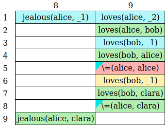
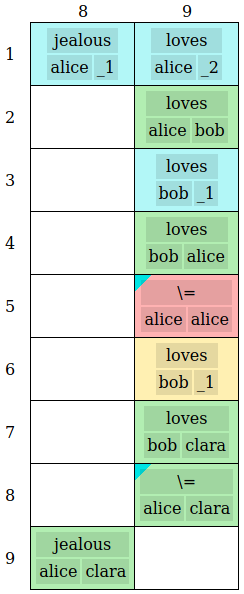
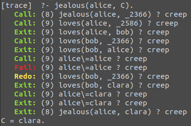
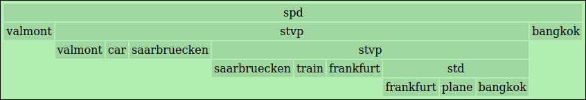

This app converts the trace of [SWI-Prolog](https://en.wikipedia.org/wiki/SWI-Prolog) into a readable interactive table.
The following screenshots show a console output and the two versions of the corresponding table in the app.
(This is the second example shown on the page.)

<table>
    <tr>
    <td>
    <td rowspan="2">
    <tr>
    <td>
</table>

The backend uses Django REST framework and the frontend is written in Vue.js.
(Like my [DAG](https://github.com/watchduck/DAG) app.)

The app can be found at **[prologtrace1.watchduck.net](http://prologtrace1.watchduck.net)**.
(The backend API is [back-prologtrace1.watchduck.net/trace](http://back-prologtrace1.watchduck.net/trace).)  
An important part of the backend is
[text_to_dicts.py](back/app/utils/text_to_dicts.py),
which is explained in
[text_to_dicts.md](back/app/utils/text_to_dicts.md).

The formulas in the table cells can be represented in two ways: Linear formulas with parentheses,
and little tables representing the [tree structure](https://en.wikipedia.org/wiki/Tree_structure).

The following screenshot shows the tree structure for a result in a common Prolog example about travel routes, 
namely the question how to get from Valmont to Bangkok. (This is the fourth example shown on the page.)
<table>
    <tr>
        <td>
        <td>
            
</table>

A proof of concept for these little tables is the separate [tree_table](https://github.com/watchduck/tree_table) app,
which uses the same backend. 
It can be found at **[treetable.watchduck.net](http://treetable.watchduck.net)**.
